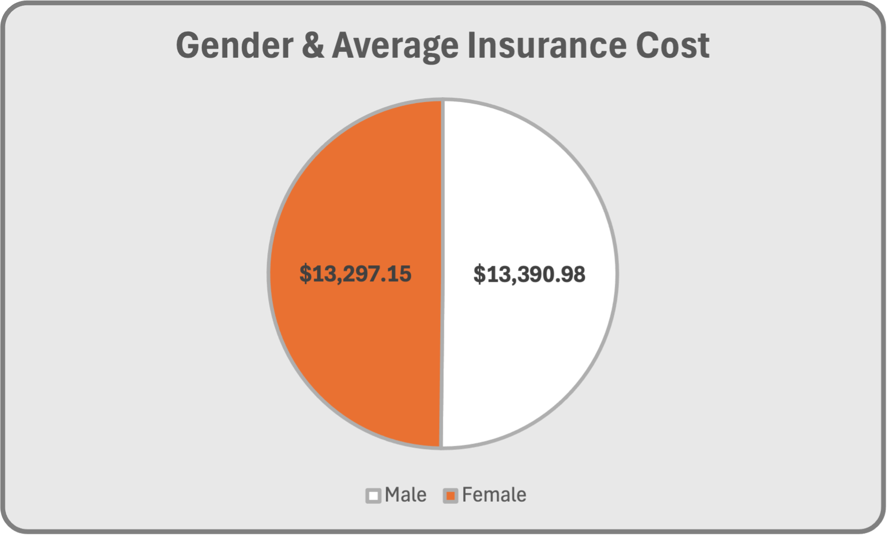

# Insurance-Cost-Analysis


## Project Introduction

This python project is part of the Codecademy 'Business Intelligence Data Analyst' career path I have been undertaking.

The project itself was completely open-ended. I was provided with a csv file containing medical insurance cost data and was tasked with using python to analyse the data set and draw out meaningful insights and conclusions. The csv file can be found in the file repository above.

I chose to research the following themes from the dataset:

- Average Insurance Cost by Age
- Average Insurance Cost by Gender
- Average Insurance Cost by BMI
- Average Insurance Cost by Smoking Status
- Average Insurance Cost by Region
- Smoking Prevalence by Age

I have broken these down below, showing the code I used to extract my findings and explaining the results. I have also used Excel to create graphs that display the conclusions in an easy to visualise way.

# First Steps
```
import csv
with open("insurance.csv") as insurance_csv:
    insurance_data = insurance_csv.read()
```
```
insurance_data_list = []
with open("insurance.csv") as insurance_csv:
    insurance_dict = csv.DictReader(insurance_csv, delimiter = ",")
    for row in insurance_dict:
        insurance_data_list.append(row)
```
The first step I took was importing the csv module and then opening the file as a file object named insurance_csv. I then used insurance_csv.read to view the file data in the output.

I then used the .DictReader function to create a variable called 'insurance_dict', which stored each row of the csv file as it's own dictionary. Once this was created, I used a for loop to iterate through 'insurance_dict' and add each row to a list called 'insurance_data_list'. In this way I created a list of dictionaries that I used throughout my analysis.

# Average Insurance Cost by Age
```
ages = []
for person in insurance_data_list:
    ages.append(person["age"])
int_ages = []
for age in ages:
    int_ages.append(int(age))
```
```
charges = []
for person in insurance_data_list:
    float_charges = float(person["charges"])
    round_float_charge = round(float_charges,2)
    charges.append(round_float_charge)
print(charges)
```
```
ages_and_charges = zip(int_ages, charges)
ages_and_charges_list = list(ages_and_charges)
print(ages_and_charges_list)
```
The first step here was to create lists that contained only the data I wanted to work with. For this question, it was 'ages' and 'charges'.

I used for loops to iterate through 'insurance_data_list' and append the 'ages' and 'charges' data to their respective lists. 'insurance_data_list' however has every value as a string value, so it was important for my analysis to make sure that both of these lists, with their values being purely numerical, were converted to either ints or floats.

Once the data was converted to a numerical type, I used the zip() function to stitch the lists together and then saved that to a list() variable called ages_and_charges_list.

I was then ready to analyse the relationship between these two points. The code I used is below.

```
below_20_cost = 0
below_20_count = 0
below_30_cost = 0
below_30_count = 0
below_40_cost = 0
below_40_count = 0
below_50_cost = 0
below_50_count = 0
below_60_cost = 0
below_60_count = 0
above_60_cost = 0
above_60_count = 0

for person in ages_and_charges_list:
    if person[0] < 20:
        below_20_cost += person[1]
        below_20_count += 1
    if 20 <= person[0] < 30:
        below_30_cost += person[1]
        below_30_count += 1
    if 30 <= person[0] < 40:
        below_40_cost += person[1]
        below_40_count += 1
    if 40 <= person[0] < 50:
        below_50_cost += person[1]
        below_50_count += 1
    if 50 <= person[0] < 60:
        below_60_cost += person[1]
        below_60_count += 1
    if person[0] >= 60:
        above_60_cost += person[1]
        above_60_count += 1

avg_below_20 = round(below_20_cost / below_20_count, 2)
avg_below_30 = round(below_30_cost / below_30_count, 2)
avg_below_40 = round(below_40_cost / below_40_count, 2)
avg_below_50 = round(below_50_cost / below_50_count, 2)
avg_below_60 = round(below_60_cost / below_60_count, 2)
avg_above_60 = round(above_60_cost / below_60_count, 2)
```
I initialised a number of variables with values of 0, shown at the top of this code block.

I then used for loops to iterate through the 'ages_and_charges_list' and add to these predefined variables depending on the if statements.

The count variables simply add 1 in order to track the number of people in that particular group, whereas the cost variables store the sum of the cost for everyone in that group.

The count variable was important, not only because it's interesting to know how large that particular data group is, but also because I needed it to calculate the average cost.

The cost variable was divided by the count variable and rounded to two decimal places to create the 'avg' variables.

The results are shown below in a bar chart.

As you can see the average cost of medical insurance increases with age throughout the age groups, with a significant disparity between the the youngest group ($8407.35) and the oldest group ($21,408.02), an increase of just over 2.5x. This is consistent with what you would expect to find from such data as medical insurance is of course more costly for elderly people who are more likley to need it.

# Average Insurance Cost by Gender
```
male_count = 0
males = []
female_count = 0
females = []

for person in insurance_data_list:
    if person["sex"] == "male":
        male_count += 1
        males.append(person["sex"])
    elif person["sex"] == "female":
        female_count += 1
        females.append(person["sex"])

male_charges = zip(males, charges)
female_charges = zip(females, charges)

male_cost = 0
for person in male_charges:
    male_cost += person[1]
avg_male_cost = round(male_cost / male_count,2)

female_cost = 0
for person in female_charges:
    female_cost += person[1]
avg_female_cost = round(female_cost / female_count,2)
```
In order to investigate any difference in insurance cost between the two genders, I once again used a for loop to iterate through 'insurance_data_list', this time adding 1 to the male or female count each time, and also adding the gender into a blank list.

I then zipped these gender lists together with the charges list to create 'male_charges' and 'female_charges', before using for loops to iterate through these and add each 'charges' record to either 'male_cost' or 'female_cost. I then took an average of these numbers to find the male and female average. The results can be seen on the pie chart below.



As you can see my analysis has found that there is no significant disparity in insurance costs between the genders, at least from the limited sample size of this dataset.

# Average Insurance Cost by BMI
```
bmi = []
float_bmi = []
total_bmi = 0
for person in insurance_data_list:
    bmi.append(person["bmi"])
for value in bmi:
    value = float(value)
    float_bmi.append(value)
for value in float_bmi:
    total_bmi += value

bmi_and_charges = zip(bmi, charges)

avg_bmi = round(total_bmi / len(insurance_data_list), 2)
print("The Average BMI of individuals within the dataset is: " + str(avg_bmi))
```
```
under_20 = 0
under_20_count = 0
under_30 = 0
under_30_count = 0
under_40 = 0
under_40_count = 0
under_50 = 0
under_50_count = 0
over_50 = 0
over_50_count = 0

for person in bmi_and_charges_list:
    if person[0] < 20:
        under_20 += person[1]
        under_20_count += 1
    if person[0] < 30:
        under_30 += person[1]
        under_30_count += 1
    if person[0] < 40:
        under_40 += person[1]
        under_40_count += 1
    if person[0] < 50:
        under_50 += person[1]
        under_50_count += 1
    if person[0] > 50:
        over_50 += person[1]
        over_50_count += 1

avg_under_20 = round(under_20 / under_20_count, 2)
avg_under_30 = round(under_30 / under_30_count, 2)
avg_under_40 = round(under_40 / under_40_count, 2)
avg_under_50 = round(under_50 / under_50_count, 2)
avg_over_50 = round(over_50 / over_50_count, 2)
```
When investigating the relationship between average insurance costs and BMI, I took the same approach as I had taken previously. I created a zipped list called bmi_and_charges (though not before I had converted the bmi values from strings to floats) and then iterated through it, adding the values to their appropriate variables using if statements.

The sum total divided by the count gave me the average numbers, which are displayed in the graph below.


We encounter a similar trend to the 'age' analysis here: the higher your bmi the higher your insurance costs. A quick search told me that anything over 25 is considered  overweight and anything over 30 is obese, which would apply to the majority of our records here.

It is also worth noting that BMI has often ben criticised as being a poor measure of someone's health.

# Average Insurance Cost by Smoking Status
```
smokers_cost = [person["charges"] for person in insurance_data_list if person["smoker"] == "yes"]
non_smokers_cost = [person["charges"] for person in insurance_data_list if person["smoker"] == "no"]

number_of_smokers = 0
for smoker in smokers_cost:
    number_of_smokers += 1
num_smokers = (float(number_of_smokers))

smokey_cost = []
for value in smokers_cost:
    smokey_cost.append(float(value))
smokers_total_charges = sum(smokey_cost)

number_of_non_smokers = 0
for non_smoker in non_smokers_cost:
    number_of_non_smokers += 1
num_non_smokers = (float(number_of_non_smokers))

non_smokey_cost = []
for value in non_smokers_cost:
    non_smokey_cost.append(float(value))
non_smokers_total_charges = sum(non_smokey_cost)

smokers_average_cost = smokers_total_charges / num_smokers
smokers_average_cost_rounded = round(smokers_average_cost, 2)
print("The Average cost for a smoker is: $" + str(smokers_average_cost_rounded))

non_smokers_average_cost = non_smokers_total_charges / num_non_smokers
non_smoke_rounded = round(non_smokers_average_cost, 2)
print("The Average cost for a non-smoker is: $" + str(non_smoke_rounded))
```
For investigating smoking I tried to use a list comprehension to make the 'smokers_cost' and 'non_smokers_cost' lists. Once again I then used for loops, but this time added the 'charges' values into a list that I then summed using the sum() function. I took rounded averages and the results are displayed below.

As you can see there is a very significant difference in these two costs, with smokers paying almost 4x as much. This is of course to be expected.

# Average Insurance Cost by Region
```
regions = []

for person in insurance_data_list:
    regions.append(person["region"])

regions_and_charges = zip(regions, charges)
regions_and_charges_list = list(regions_and_charges)

northwest_cost = 0
northwest_count = 0
southwest_cost = 0
southwest_count = 0
northeast_cost = 0
northeast_count = 0
southeast_cost = 0
southeast_count = 0

for person in regions_and_charges_list:
    if person[0] == "northwest":
        northwest_cost += person[1]
        northwest_count += 1
    if person[0] == "northeast":
        northeast_cost += person[1]
        northeast_count += 1
    if person[0] == "southwest":
        southwest_cost += person[1]
        southwest_count += 1
    if person[0] == "southeast":
        southeast_cost += person[1]
        southeast_count += 1

northwest_avg = round(northwest_cost / northwest_count, 2)
southwest_avg = round(southwest_cost / southwest_count, 2)
northeast_avg = round(northeast_cost / northeast_count, 2)
southeast_avg = round(southeast_cost / southeast_count, 2)
```
This data was analysed like the others, zipped lists, for loops and calculating averages. Results are shown below.

As you can see the insurance cost does actually vary quite significantly, with almost $2,500 dollars separting the cheapest from the most expensive region. This is your sign to pack your bags and move to the southwest.

# Smoking Prevalence by Age
```
smokerlist = []
for person in insurance_data_list:
    smokerlist.append(person["smoker"])

age_and_smoke = zip(int_ages, smokerlist)
age_and_smoke_list = list(age_and_smoke)
```
```
below_20_count = 0
below_20_smokers = 0
below_20_non_smokers = 0

below_30_count = 0
below_30_smokers = 0
below_30_non_smokers = 0

below_40_count = 0
below_40_smokers = 0
below_40_non_smokers = 0

below_50_count = 0
below_50_smokers = 0
below_50_non_smokers = 0

below_60_count = 0
below_60_smokers = 0
below_60_non_smokers = 0

above_60_count = 0
above_60_smokers = 0
above_60_non_smokers = 0

for person in age_and_smoke_list:
    if person[0] < 20:
        below_20_count += 1
        if person[1] == "yes":
            below_20_smokers += 1
        else:
            below_20_non_smokers += 1
    if 20 <= person[0] < 30:
        below_30_count += 1
        if person[1] == "yes":
            below_30_smokers += 1
        else:
            below_30_non_smokers += 1
    if 30 <= person[0] < 40:
        below_40_count += 1
        if person[1] == "yes":
            below_40_smokers += 1
        else:
            below_40_non_smokers += 1
    if 40 <= person[0] < 50:
        below_50_count += 1
        if person[1] == "yes":
            below_50_smokers += 1
        else:
            below_50_non_smokers += 1
    if 50 <= person[0] < 60:
        below_60_count += 1
        if person[1] == "yes":
            below_60_smokers += 1
        else:
            below_60_non_smokers += 1
    if person[0] > 60:
        above_60_count += 1
        if person[1] == "yes":
            above_60_smokers += 1
        else:
            above_60_non_smokers += 1
        
below_20_percent = round(below_20_smokers / below_20_count *100, 2)
below_30_percent = round(below_30_smokers / below_30_count *100, 2)  
below_40_percent = round(below_40_smokers / below_40_count *100, 2)  
below_50_percent = round(below_50_smokers / below_50_count *100, 2)  
below_60_percent = round(below_60_smokers / below_60_count *100, 2)
above_60_percent = round(above_60_smokers / above_60_count *100, 2)  
```
My analysis methods here were almost identical, although this time I had three variables to add to: 'overall count', 'smoker count', and 'non-smoker count'. For this I used an 'else' statement in my for loops. The logic first checked their age and adjusted the count variable of that age group, before splitting into an if/else statement to determine whether the 'smoker' or 'non-smoker' count was updated. I was expecting to find a trend that showed much higher levels among older people and much lower levels among younger people. The results are shown below.


The darker red line on this graph tells the main story. It shows that smoking prevalence is relatively fixed around 20-22% from ages 0-49 (hopefully this doesn't mean 20% of 0 year olds are smoking). Surpisingly a drop off is then seen in the 50-59 age group to around 15% before it bounces right back in the 60+ group to a high of just under 25%.


